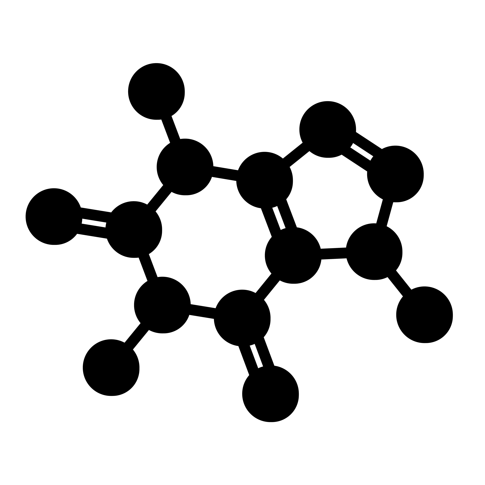

# Molecule-icons Generator!

Generate nice icons of molecules from SMILES.

This program follows the topology of SMILES chemical structures and creates an icon.
The atoms' colours are inspired by the [CPK colouring convention](https://sciencenotes.org/molecule-atom-colors-cpk-colors/)

## Try the web app:

[Molecules-icons generator web app](https://molecule-icon-generator.streamlit.app/) powered by streamlit

[](https://molecule-icon-generator.streamlit.app/)


### Step 1: clone the repository

```
git clone https://github.com/lmonari5/molecule-icon-generator.git
```

### Step 2: install packages and requirements

For Linux:

```
xargs -a packages.txt sudo apt-get install 
pip install -r requirements.txt
```

### Step 3: Have Fun

- Run the code from the command line:

 ```
  python molecules_icon_generator.py "CC(=O)Nc1ccc(cc1)O" --name paracetamol --rdkit_svg
 ```

- Or from the python interpreter:

 ```
 from molecules_icon_generator import icon_print 
 icon_print("CC(=O)Nc1ccc(cc1)O", name = 'paracetamol', rdkit_svg = True, single_bonds = False, remove_H = False, verbose=False)
 ```

## Tip

I enjoy working on this project in my free time, especially at night. If you want to support me with a coffee, just [click on the caffeine below](paypal.me/lucamonari99)
[](paypal.me/lucamonari99)
