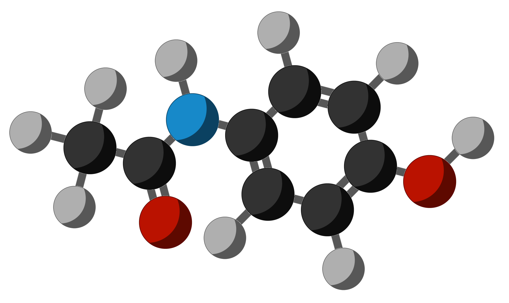

# molecule-icon-generator

Generate nice icons of molecules from SMILES.

This program takes some icons of atoms and bonds (provided with the code) and following the topology of an SMILES chemical structure combine the into an icon. 

## Requirements
- rdkit (`pip install rdkit`)
- opencv (`pip install opencv-python`)
- argparse (`pip install argparse`)
- numpy (`pip install numpy`)

### Step 1: clone the repository

```
git clone https://github.com/lmonari5/molecule-icon-generator.git
```

### Step 2: insert the directory with the atom and bond icons

Modify the code, lin 19, anche the variable with the path to the directory containing the base icons:

```
atom_icon_dir = "/your/path/to/base-icons/"
```

### Step 3: Have Fun

- Run the code from command line:

 ```
  python molecules_icon_generator.py "CC(=O)Nc1ccc(cc1)O" --name paracetamol --rdkit_draw
 ```

- Or from the python interpreter:

 ```
 from molecules_icon_generator import icon_print 
 icon_print("CC(=O)Nc1ccc(cc1)O", name = 'paracetamol', rdkit_img = True, single_bonds = False, verbose=False)
 ```
